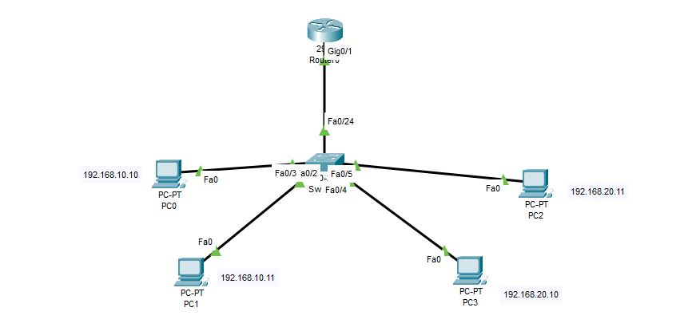

# LAN Scenario 02 – VLAN & Subnetting with Router-on-a-Stick

## 🎯 Objective
Design a segmented LAN with two VLANs using subnetting and inter-VLAN routing through a single physical router port (Router-on-a-Stick).

## 🧱 Devices Used
- 1× Cisco 2960 Switch
- 1× Cisco 2911 Router
- 4× PCs (2 per VLAN)
- Copper Straight-through cables

## 📐 Topology



## 🌐 IP Addressing

| Device | IP Address     | VLAN | Subnet             | Gateway         |
|--------|----------------|------|--------------------|-----------------|
| PC0    | 192.168.10.10  | 10   | 192.168.10.0/24    | 192.168.10.1    |
| PC1    | 192.168.10.11  | 10   | 192.168.10.0/24    | 192.168.10.1    |
| PC2    | 192.168.20.10  | 20   | 192.168.20.0/24    | 192.168.20.1    |
| PC3    | 192.168.20.11  | 20   | 192.168.20.0/24    | 192.168.20.1    |

## ⚙️ Configuration Summary

### Switch VLAN Configuration:
```bash
vlan 10
name Sales
vlan 20
name HR
interface range fa0/2 - 3
 switchport mode access
 switchport access vlan 10
interface range fa0/4 - 5
 switchport mode access
 switchport access vlan 20
interface fa0/1
 switchport mode trunk
 switchport trunk encapsulation dot1q
